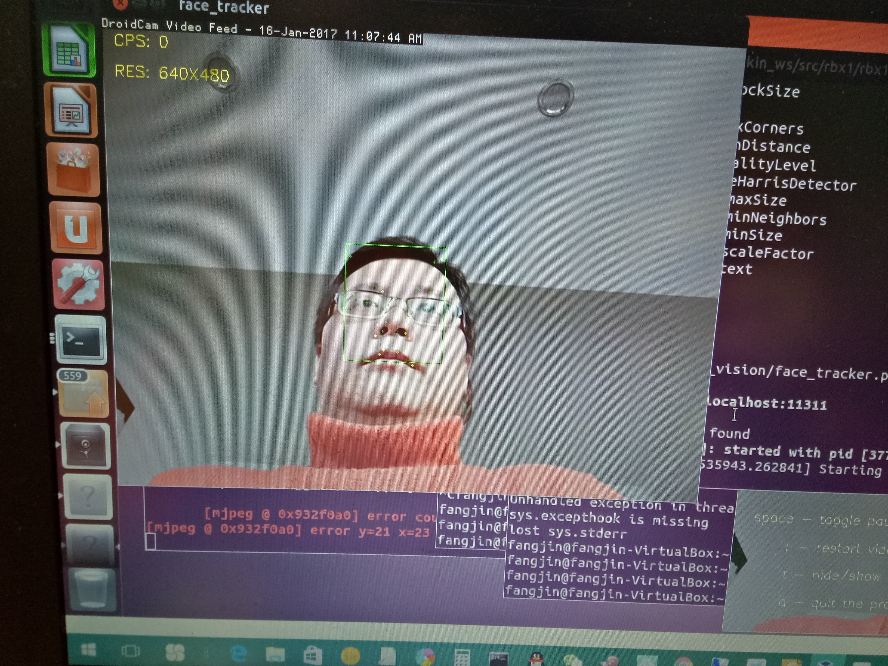
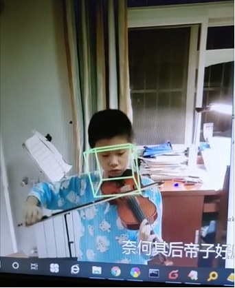

# ROSplay

ROS机器人学习、创作

零、基础环境

Virtualbox5.2.8

虚拟机： >4G内存、开启硬件加速、声音（支持输入、输出）

操作系统：Ubuntu 12.04.1 LTS 桌面版

ROS版本：hydro

# 一、xf_voice_speak 中文语音控制机器人运动

思路：先把语音转换成文字，然后文字与动作对应，动作再驱动机器人运动

（1）创建record_speak.cpp，通过修改iat_publish_speak.cpp(科大讯飞)，并将文字输出到xfspeech主题

参考：https://www.ncnynl.com/archives/201702/1287.html

下载xf_voice_robot目录到~/下

代码结构：

├── CMakeLists.txt

├── include

│   ├── formats.h

│   ├── linuxrec.h

│   ├── msp_cmn.h

│   ├── msp_errors.h

│   ├── msp_types.h

│   ├── qisr.h

│   ├── qtts.h

│   ├── speech_recognizer.h

│   └── xf_voice_robot

├── msc

│   ├── f0d5bd0f211933e7aad71ef72578125d

│   └── msc.cfg

├── package.xml

├── src

│   ├── asr_sample.c

│   ├── gm_continuous_digit.abnf

│   ├── iat_publish_speak.cpp

│   ├── iat_record.c

│   ├── iat_sample.c

│   ├── linuxrec.c

│   ├── msc

│   │   ├── f0d5bd0f211933e7aad71ef72578125d

│   │   │   ├── u.data

│   │   │   └── urec.data

│   │   └── msc.cfg

│   ├── my_voice_nav.py

│   ├── record_speak.cpp

│   ├── sch_speak.c

│   ├── sch_text.c

│   ├── source.txt

│   ├── speech_recognizer.c

│   ├── tts_sample.c

│   ├── tts_sample.wav

│   ├── tts_subscribe_speak.cpp

│   └── userwords.txt

└── turtlebot_voice_nav.launch

编译：

$ cd ~/catkin_ws/

$ cp -R xf_voice_robot  ~/catkin_ws/src/

$ cd ~/catkin_ws/

$ catkin_make

新开终端1(CTRL+ALT+T)

$ roscore 

新开终端2: (订阅xfwakeup主题，发布xfspeech主题和xfwords主题)

$ cd ~/catkin_ws/

$ roscd xf_voice_robot/src  （所有的rosrun要在源目录执行，因为一些相对路径的目录在src目录下！！）

$ rosrun xf_voice_robot record_speak (！！考虑到科大讯飞SDK接口有日访问500次的限制，这条命令可以放在所有终端命令都执行完之后再执行^_^ )

新开终端3：（xfspeech主题是录音转成的文字）

$ rostopic echo /xfspeech

新开终端4：（xfwords主题是错误提示文字）

$ rostopic echo /xfwords

（2）创建my_voice_nav.py(通过修改voice_nav.py)，订阅xfspeech主题，（触发回调函数）将识别出的中文与动作对应

启动模拟器

新开终端6：

$ roslaunch rbx1_bringup fake_turtlebot.launch

新开终端7：

$ rosrun rviz rviz -d \`rospack find rbx1_nav\`/sim.rviz

运行voice_nav节点

新开终端8：

$ roslaunch xf_voice_robot turtlebot_voice_nav.launch

注：（1）要保证网络畅通，因为要访问科大讯飞SDK接口

    （2）声音环境，即录音、播放都要正常
    
    （3）由于科大讯飞SDK接口有日访问总量限制，调用接口的命令尽量只在使用时才执行（看上面步骤中的注释），不使用了尽量关闭

# 二、机器人视觉

由于没有摄像头设备，故采用手机模拟摄像头。

1、从手机摄像头获取图像

Android手机安装DroidCam

在unbuntu12.04上采用以下方式读取摄像头视频流

video = "http://192.168.1.101:4747/mjpegfeed?.mjpg"

cap = cv2.VideoCapture(video)

请参考testCam.py
   
2、使用

终端1

$ roscore

终端2

$ roslaunch rbx1_vision video2ros.launch input:="http://192.168.1.101:4747/mjpegfeed?.mjpg"

终端3

$ rosrun image_view image_view image:=/camera/rgb/image_color

终端4

$ rosrun rbx1_vision cv_bridge_demo.py

3、人脸识别

$ roslaunch rbx1_vision face_tracker.launch

参看效果图：  

4、头部跟踪

将head-pose-estimation功能加入，

参考： https://github.com/fjibj/head-pose-estimation

效果图：

